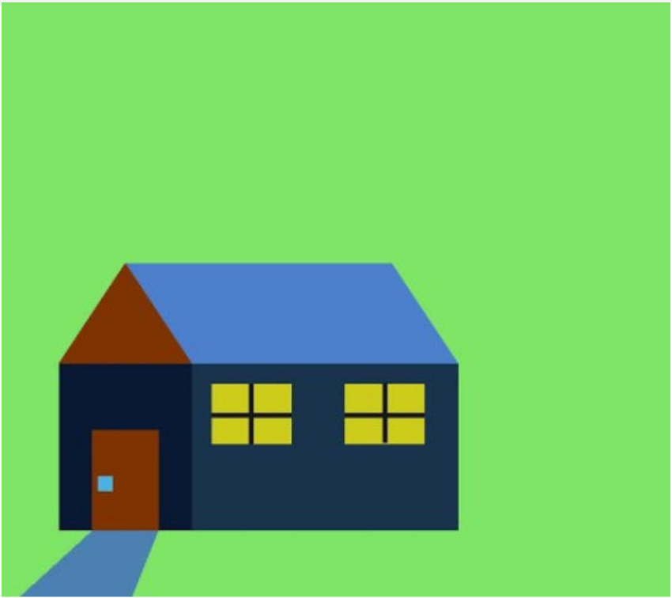

# Assignment 1
---

## 1. How many faces is too many faces?

### Breif
Calculate the location of vertices and face indices of any two type of dodecahedron and make a 3D model from it.

<table>
  <tr>
    <td>
      
    </td>
    <td>
      
    </td>
  </tr>
  <tr align="center">
  <td>
    <strong>Regular Dodecahedron</strong>
  </td>
    <td>
        <strong>Decogonal Prism</strong>
    </td>
    </tr>
</table>

## 2. House

### Breif
Create a 2D House using OpenGL as shown in the image.

<table>
  <tr>
    <td>
      
    </td>
    <td>
      
    </td>
  </tr>
  <tr align="center">
  <td>
    <strong>Original Image</strong>
  </td>
    <td>
        <strong>OpenGL</strong>
    </td>
    </tr>
</table>

## Instruction
- To run the code, you need to have `OpenGL` and `GLUT` installed in your system.

## How to run
### CodeBlocks
- Create a GLUT project in CodeBlocks.
- Copy the code from the the file that you want to run and paste it in the `main.cpp` file of the project.
- Run the project.

### Terminal
- Compile the code using the following command
    ```bash
    g++ -o main main.cpp -lGL -lGLU -lglut
    ```
- Run the code using the following command
    ```bash
    ./main
    ```
